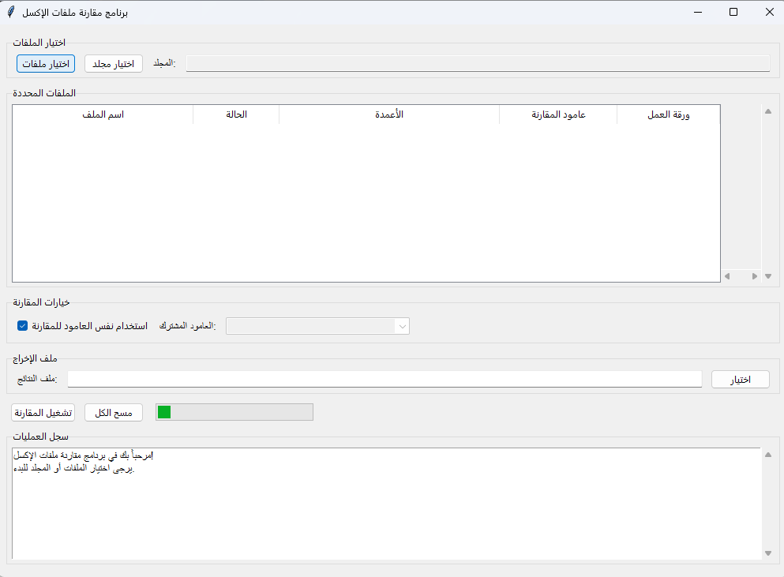

# مقارن بيانات الإكسل | Excel Data Comparer

<p align="center">
  
  <br>
  <strong>أداة قوية لمقارنة وتحليل ملفات الإكسل بسهولة</strong>
</p>

<div dir="rtl">

## 🌟 نظرة عامة

**مقارن بيانات الإكسل** هو برنامج مفتوح المصدر يساعدك على مقارنة ملفات الإكسل المختلفة وتحديد الاختلافات والتشابهات بينها. يمكنك استخدامه لتحديد السجلات الفريدة في كل ملف، وإنشاء تقارير مفصلة عن نتائج المقارنة.

### ✨ المميزات الرئيسية

- 🔍 **مقارنة دقيقة**: مقارنة البيانات بناءً على أعمدة محددة
- 📊 **تقارير شاملة**: إنشاء تقارير إكسل منسقة تعرض نتائج المقارنة
- 🛠️ **خيارات متعددة**: إمكانية تحديد الأعمدة المراد مقارنتها
- 🖥️ **واجهتان مختلفتان**: استخدم واجهة المستخدم الرسومية أو سطر الأوامر
- 🚀 **سرعة عالية**: معالجة فعالة حتى مع الملفات الكبيرة

## 📋 طريقة الاستخدام

يتوفر البرنامج بواجهتين مختلفتين لتناسب احتياجاتك:

### 1️⃣ واجهة المستخدم الرسومية (GUI)

<p align="center">
  
</p>

واجهة سهلة الاستخدام تتيح لك:

1. **إضافة ملفات**: اختر ملفات الإكسل التي تريد مقارنتها
2. **تحديد أعمدة المقارنة**: اختر الأعمدة التي تريد المقارنة بناءً عليها
3. **تخصيص التقرير**: ضبط خيارات التقرير النهائي
4. **تشغيل المقارنة**: الحصول على نتائج المقارنة بنقرة واحدة

### 2️⃣ واجهة سطر الأوامر (CLI)

للمستخدمين المتقدمين ومحبي سطر الأوامر، يمكنك استخدام نسخة CLI:

```bash
python cli/excel_compare_cli.py --input "مجلد_الملفات" --column "رقم_الهوية" --output "نتائج_المقارنة.xlsx"
```

#### الخيارات المتاحة:

- `--input` أو `-i`: مجلد يحتوي على ملفات الإكسل للمقارنة (الافتراضي: "in")
- `--column` أو `-c`: اسم العامود الذي سيتم المقارنة على أساسه
- `--output` أو `-o`: مسار ملف التقرير الناتج (الافتراضي: "comparison_results.xlsx")
- `--interactive` أو `-int`: تشغيل البرنامج في الوضع التفاعلي

#### أمثلة على الاستخدام:

1. **الوضع التفاعلي**:
```bash
python cli/excel_compare_cli.py --interactive
```

2. **تحديد مجلد مخصص للإدخال**:
```bash
python cli/excel_compare_cli.py --input "ملفات_المقارنة"
```

3. **تحديد عامود للمقارنة**:
```bash
python cli/excel_compare_cli.py --column "رقم_الهوية"
```

4. **تحديد اسم ملف الإخراج**:
```bash
python cli/excel_compare_cli.py --output "نتائج_المقارنة.xlsx"
```

5. **استخدام جميع الخيارات معاً**:
```bash
python cli/excel_compare_cli.py --input "ملفات_المقارنة" --column "رقم_الهوية" --output "نتائج_المقارنة.xlsx"
```

## ⚙️ التثبيت

### المتطلبات الأساسية

- Python 3.6 أو أحدث
- المكتبات المطلوبة: pandas, openpyxl, xlrd, matplotlib

### تثبيت المكتبات

```bash
pip install -r requirements.txt
```

### تشغيل البرنامج

#### الواجهة الرسومية (قريباً):

```bash
python gui/excel_compare_gui.py
```

#### سطر الأوامر:

```bash
python cli/excel_compare_cli.py [الخيارات]
```

## 📊 مثال للنتائج

<p align="center">
  
</p>

يتضمن التقرير النهائي:

- **ملخص المقارنة**: نظرة عامة على الملفات والسجلات
- **السجلات الفريدة**: جميع السجلات الفريدة من كل الملفات
- **تفاصيل كل ملف**: السجلات الفريدة في كل ملف
- **إحصائيات**: معلومات إحصائية عن نتائج المقارنة

## 🤝 المساهمة

نرحب بمساهماتكم! إذا كنت ترغب في المساهمة:

1. قم بعمل Fork للمشروع
2. أنشئ فرع جديد لميزتك (`git checkout -b feature/amazing-feature`)
3. قم بإجراء تغييراتك وحفظها (`git commit -m 'إضافة ميزة رائعة'`)
4. ارفع التغييرات إلى الفرع الخاص بك (`git push origin feature/amazing-feature`)
5. افتح طلب دمج (Pull Request)

## 📝 الترخيص

هذا المشروع مرخص تحت رخصة MIT - انظر ملف [LICENSE](LICENSE) للتفاصيل.

## 📧 التواصل

إذا كان لديك أي أسئلة أو اقتراحات، لا تتردد في التواصل معنا:

- البريد الإلكتروني: abutlb10015@gmail.com
- لينكد إن: [Abdullah Altwijri](https://www.linkedin.com/in/abdullah-altwijri-b053b1234)

</div>

---

<div dir="ltr">

# Excel Data Comparer

<p align="center">
  
  <br>
  <strong>A powerful tool for comparing and analyzing Excel files with ease</strong>
</p>

## 🌟 Overview

**Excel Data Comparer** is an open-source application that helps you compare different Excel files and identify the differences and similarities between them. You can use it to find unique records in each file and generate detailed reports about comparison results.

### ✨ Key Features

- 🔍 **Precise Comparison**: Compare data based on specified columns
- 📊 **Comprehensive Reports**: Create formatted Excel reports showing comparison results
- 🛠️ **Multiple Options**: Ability to select columns to compare
- 🖥️ **Two Interfaces**: Use either the GUI or command-line interface
- 🚀 **High Performance**: Efficient processing even with large files

## 📋 How to Use

The application is available in two different interfaces to suit your needs:

### 1️⃣ Graphical User Interface (GUI)

<p align="center">
  
</p>

An easy-to-use interface that allows you to:

1. **Add Files**: Choose Excel files you want to compare
2. **Select Comparison Columns**: Choose columns to base the comparison on
3. **Customize Report**: Adjust final report options
4. **Run Comparison**: Get comparison results with one click

### 2️⃣ Command Line Interface (CLI)

For advanced users and command line enthusiasts, you can use the CLI version:

```bash
python cli/excel_compare_cli.py --input "files_folder" --column "ID" --output "comparison_results.xlsx"
```

#### Available Options:

- `--input` or `-i`: Folder containing Excel files to compare (default: "in")
- `--column` or `-c`: Column name to use for comparison
- `--output` or `-o`: Path for the output report file (default: "comparison_results.xlsx")
- `--interactive` or `-int`: Run the program in interactive mode

#### Usage Examples:

1. **Interactive Mode**:
```bash
python cli/excel_compare_cli.py --interactive
```

2. **Specify Custom Input Folder**:
```bash
python cli/excel_compare_cli.py --input "comparison_files"
```

3. **Specify Comparison Column**:
```bash
python cli/excel_compare_cli.py --column "ID"
```

4. **Specify Output File Name**:
```bash
python cli/excel_compare_cli.py --output "comparison_results.xlsx"
```

5. **Use All Options Together**:
```bash
python cli/excel_compare_cli.py --input "comparison_files" --column "ID" --output "comparison_results.xlsx"
```

## ⚙️ Installation

### Prerequisites

- Python 3.6 or newer
- Required libraries: pandas, openpyxl, xlrd, matplotlib

### Installing Libraries

```bash
pip install -r requirements.txt
```

### Running the Program

#### Graphical Interface (Coming Soon):

```bash
python gui/excel_compare_gui.py
```

#### Command Line:

```bash
python cli/excel_compare_cli.py [options]
```

## 📊 Sample Results

<p align="center">
  
</p>

The final report includes:

- **Comparison Summary**: Overview of files and records
- **Unique Records**: All unique records from all files
- **File Details**: Unique records in each file
- **Statistics**: Statistical information about comparison results

## 🤝 Contributing

Contributions are welcome! If you'd like to contribute:

1. Fork the project
2. Create your feature branch (`git checkout -b feature/amazing-feature`)
3. Commit your changes (`git commit -m 'Add some amazing feature'`)
4. Push to the branch (`git push origin feature/amazing-feature`)
5. Open a Pull Request

## 📝 License

This project is licensed under the MIT License - see the [LICENSE](LICENSE) file for details.

## 📧 Contact

If you have any questions or suggestions, feel free to contact us:

- Email: abutlb10015@gmail.com
- LinkedIn: [Abdullah Altwijri](https://www.linkedin.com/in/abdullah-altwijri-b053b1234)

</div>